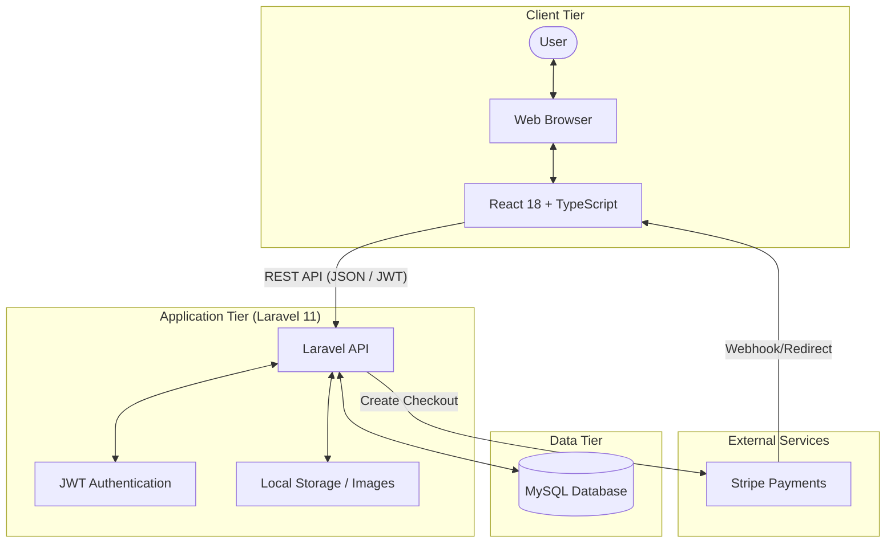

This is the updated comprehensive **VenueSync** README, now featuring a Mermaid-style system architecture diagram to visualize the interaction between the React frontend, Laravel backend, and external services.

---

# VenueSync — Event & Venue Booking Management System

VenueSync is a full-stack platform designed to streamline the connection between event planners, venue owners, and administrators. From real-time venue searching and filtering to Stripe-integrated payments and QR entry scanning, it provides an end-to-end solution for event management.

## 🏗️ System Architecture

The following diagram illustrates how the React frontend interacts with the Laravel API, the MySQL database, and external payment gateways.

---

## 🚀 Quick Start (Installation)

### 1. Backend Setup (Laravel)

1. **Environment:** Ensure XAMPP (Apache + MySQL), Composer, and PHP 8.2 are installed.
2. **Database:** Open `phpMyAdmin` and create a new database named `venuesync`.
3. **Configuration:** Copy `.env.example` to `.env`. Update your `DB_PASSWORD` and set `FRONTEND_URL=http://localhost:5173`.
4. **Auto-Setup:** Run the **`SETUP.bat`** file to handle `composer install`, migrations, and seeding.
5. **Start API:** Run `php artisan serve`. The API runs at `http://localhost:8000/api`.

### 2. Frontend Setup (React)

1. **Install Dependencies:** Run `pnpm install` in the frontend directory.
2. **API Connection:** In `src/api/client.ts`, set `BASE_URL = "http://localhost:8000/api"`.
3. **Run:** Execute `pnpm dev` to start the development server.

---

## 🔑 Demo Access

Explore the system using these pre-seeded accounts:

| Role | Email | Password |
| --- | --- | --- |
| **Admin** | `admin@venuesync.pk` | `password123` |
| **Owner** | `owner@venuesync.pk` | `password123` |
| **Planner** | `planner@venuesync.pk` | `password123` |

---

## ✨ Key Features

### 📅 Advanced Booking Workflow

* **Smart Search:** Filter venues by location, price, capacity, and amenities.
* **Payment Integration:** Stripe checkout for secure transactions.
* **PDF Invoices:** Downloadable A4 invoices generated directly in-browser.
* **QR Scanning:** Entry scanner for guest list management.

### 🛠️ Management Tools

* **Owner Dashboard:** Revenue charts, venue management, and multi-image uploads.
* **Planner Suite:** Budget tracking, event timelines, and guest management.
* **Admin Panel:** System analytics and dispute resolution.

### 🔒 Security & Performance

* **Role-Based Access (RBAC):** Protected routes redirect users based on their specific role.
* **JWT Auth:** Secure, token-based authentication for all API requests.
* **Image Handling:** Drag-and-drop uploads with live previews and 10MB size validation.

---

## 🛠️ Tech Stack

* **Frontend:** React 18, TypeScript, Tailwind CSS v4, React Router v7, Recharts.
* **Backend:** Laravel 11, JWT (JSON Web Tokens).
* **Database:** MySQL (via XAMPP).
* **Integrations:** Stripe API for payments.

---

## 📂 Troubleshooting

* **Migration Fails:** Check that XAMPP MySQL is running and the `venuesync` database exists.
* **CORS Errors:** Verify the `FRONTEND_URL` in your backend `.env` matches your frontend port.
* **Command Not Found:** Ensure `php` and `composer` are added to your system's PATH.
